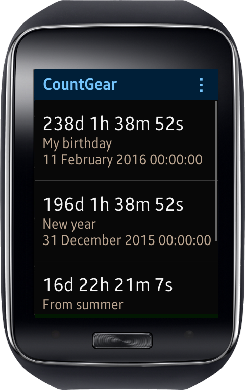
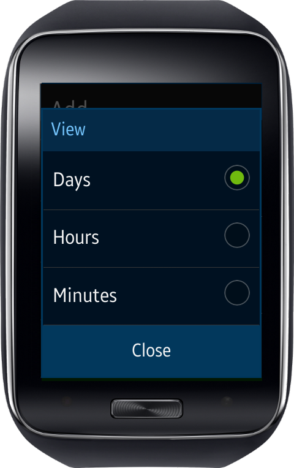
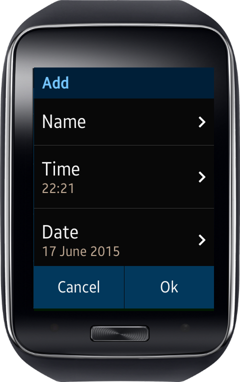
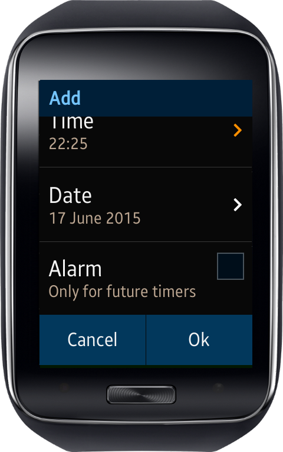
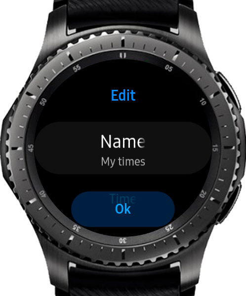
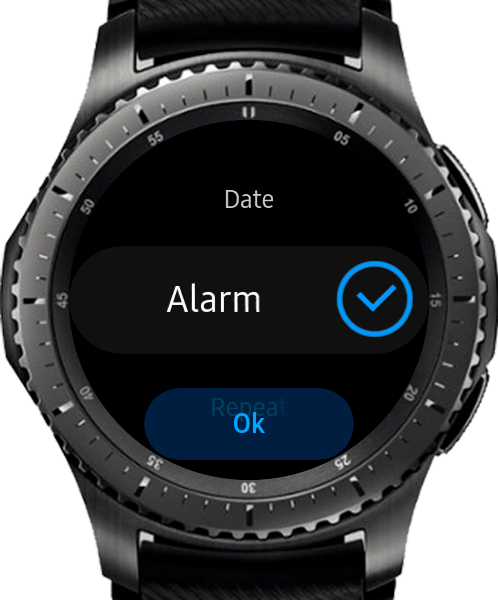
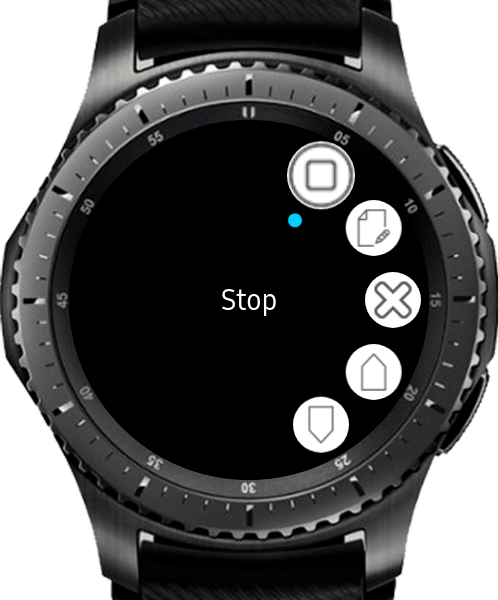

# CountGear
Count time to event or passed from event

Features:
* Unlimited counters.
* Ability to set date and time.
* You can also name you counter.
* Ability to set alarm for future events. When it occurs, app will launch, device vibrate and program tell you which event occurred.
* Counters can be removed or edited.
* You can set view to display time in days or hours or minutes.
* Click on counter for context menu

Note! If you have Gear 2, you need to install free TypeGear keyboard from store to have ability to enter counter name! 